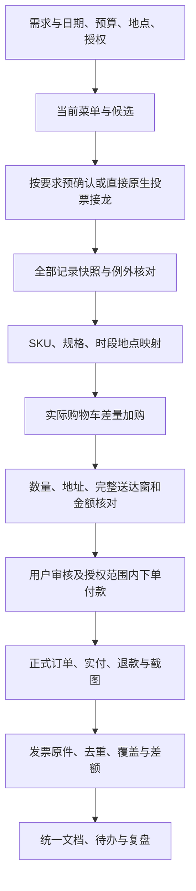

# 大促支持通用SOP

目标：让一次需求能追到实际商品、订单、金额与凭据；按当前授权推进，保持20分钟购物车核对、25分钟真实状态目标。

| 阶段 | 要完成的工作 | 完成标准 |
|---|---|---|
| 需求 | 使用已有上下文，核具体日期、范围、预算、单位、地址和授权 | 执行计划可判断下一步；未知标明 |
| 菜单 | 按授权选最近可配送店；核销售单位和实际套餐 | 候选与实际菜单对应，照片不代替规格 |
| 收集 | 正确群、当前身份、原生投票接龙；需要试跑先试跑 | 逐字内容及设置、正式消息和对象可回读 |
| 统计 | 全部分页、快照、每人数量及例外；咖啡拆时段地点 | 人数/杯数/商品单位明确，不漏尾页 |
| 加购 | 当前实际SKU、库存和购物车差量，断连后先恢复状态 | 每种规格数量正确，范围外商品已核清 |
| 审核 | 逐单数量、地址、送达窗、费用和缺口 | 用户拿到可核对成果；不提前付款 |
| 订单 | 授权范围内购买，或用户自己下单后回读 | 正式订单号、支付状态和实际金额 |
| 财务 | 实付/到账退款去重，保存可读截图 | 逐单及合计可追溯，未知金额不混算 |
| 发票 | 原件下载、票号去重、订单/组件匹配 | 原件可打开，差额及可能重叠明确 |
| 收尾 | 统一文档更新、保留原材料、处理旧调度和复盘 | 文档实际回读、待办清晰、真实状态 |

25分钟是一次点餐请求的墙钟目标，含前置检查、验证与等待。跨日收集、发票等待另有真实日历时间，不用“活动25分钟完成”包装。15分钟提前交接风险；20分钟交核对；25分钟如实报告。用户要求继续时不中断授权工作。

异常处理：缺信息先做不依赖项；缺货不静默替换；结果不明先查询再重试；手机断连不重做已完成商品；用户已下单停止重复购买；发票金额不能反推支出。新工具布局遵守当时文档，历史坐标、权限和默认规则不继承。
